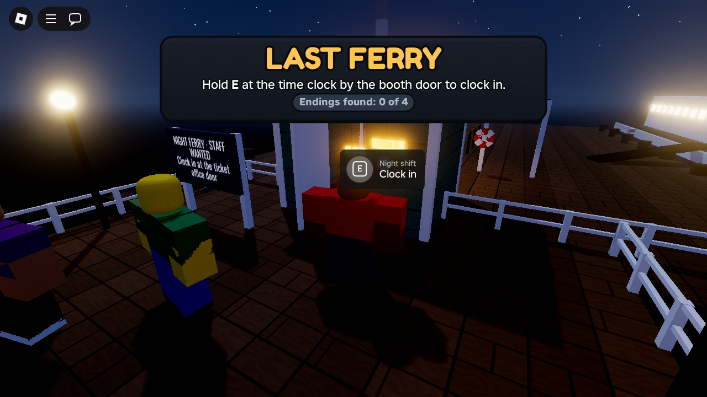
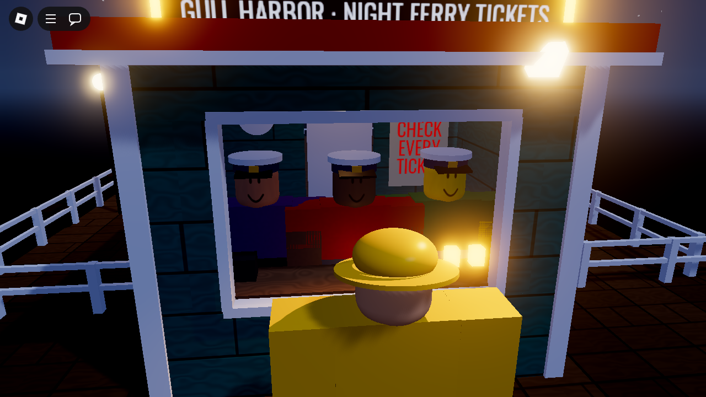
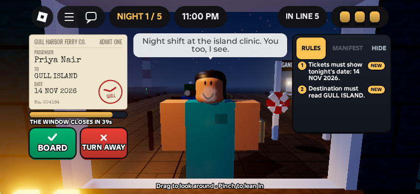

# Last Ferry

A Roblox rules-horror game from Phoenix Feather Studios. You work the night
ticket window for the last ferry to Gull Island. Twenty-seven years ago the
*Marigold* sank with everyone aboard, and this week the drowned are back in the
queue, trying to get home.

- **Five nights.** Each one adds a rule, and the drowned learn to hide one more
  tell.
- **Every passenger is a call:**
  1. Read the ticket.
  2. Look at the person: breath in the cold, dripping seawater, a shadow under
     the lamp, whether they know your name.
  3. Check the rules card and the manifest.
  4. Press **BOARD** or **TURN AWAY**.
- **Three lanterns a night.** Each wrong call puts one out. Lose all three and
  the tide comes in.
- **Four endings, one of them secret.** Plus a little girl in a red coat who
  asks every night whether this is the ferry home.
- **It's a Roblox game first.** You arrive on the pier behind the booth as your
  own avatar, with your friends; hold **E** at the time clock and the whole
  server clocks in. You work the window in first person, side by side at the
  counter in the harbor's captain's caps. Passengers are classic Robloxians who
  talk in Roblox-style chat bubbles and walk smoothly on every screen, the
  night, the clock and your lanterns sit in Roblox's own top bar beside its
  buttons, the HUD is Roblox's chunky house style, and the player list keeps
  your Endings and Shifts.
- **One to four players** share the booth, and anyone can make the call.
- **Controls:**
  - On the pier: Roblox's usual controls, camera, chat and emotes.
  - In the booth: walk with WASD or the thumbstick; look with the right mouse
    button, a finger or the right stick; scroll, pinch or R2 to lean in.
  - **B** / **T** (gamepad **A** / **B**) to board or turn away, **P** (**X**)
    to take a torn page, and **Enter** or **Space** to continue. Gamepad A and
    Space still jump when there's nothing to press.

Everything is built from parts and code, and the sounds are Roblox's built-in
ones: no asset IDs, no licences to check. The story design is in
[GAME_DESIGN.md](GAME_DESIGN.md) and the code map is in
[ARCHITECTURE.md](ARCHITECTURE.md).

## What it looks like

These are renders of the real game, running in the test simulator, drawn by
[tools/preview](tools/preview/README.md): a three.js approximation of Roblox's
renderer, close enough to judge framing, colour, layout and whether a tell can
be seen. Roblox itself will differ in materials, light and fog, and players will
be wearing their own avatars rather than the simulator's plain blocky ones.



**The pier.** You spawn behind the booth as your own avatar. The notice board and
the banner say what to do; the time clock by the back door has Roblox's own
"Clock in" prompt.

| A living regular at the window | One of the drowned (1999 ticket) |
| --- | --- |
|  |  |

**The window, in first person.** Passengers are classic Robloxians and talk in
bubbles drawn like Roblox's own, which stay up for the whole window, over their
heads and clear of the HUD. The living breathe fog and cast a shadow back and to
the right of them under the lamp. The drowned carry old tickets with the blue
anchor stamp; this one drips seawater, wears seaweed, and has a torn page from
the harbormaster's ledger tucked behind the ticket (TAKE PAGE). The night, the clock
and the lanterns are pills in Roblox's own top bar, beside its buttons; below
them the HUD is Roblox's chunky style: the ticket, green BOARD, red TURN AWAY,
and the rules on the right.

| The clerks, seen from the dock | On a phone |
| --- | --- |
|  |  |

**Friends share the booth** in the harbor's captain's cap, each at a stand behind
the counter; whoever stands between you and the window turns see-through on
your screen. **On a phone** the status stays up in Roblox's top bar, the HUD
scales down and keeps the rules panel clear of the jump button, and there's
room above the passenger's head for even the longest line.

## Status

| Area | State |
| --- | --- |
| Game logic (rules, queue generation, runs, endings) | Built, fuzz-tested over thousands of generated nights |
| Shift flow (intro, window, summary, retry, ending, co-op Continue) | Built, simulated end to end |
| Server (world, passengers, crew, remotes, saves) and client (cameras, HUD, crowd, sounds) | Built, run together in a headless Roblox simulator with players' characters |
| Roblox look and feel (avatars and pier lobby, classic Robloxian passengers, chat bubbles, status in Roblox's top bar, chunky HUD, player list, built-in sounds, smooth movement on every screen) | Built, tested headless, previewed with an approximate renderer |
| Looks, lighting, feel, pacing in real Roblox | **Not yet seen.** It needs a playtest in Roblox Studio on your machine ([PLAYTEST.md](PLAYTEST.md)) |
| Store page, badges, icon, questionnaire | To do before publishing (checklist below) |

## Play it in Studio

1. Build `LastFerry.rbxl` with `rojo build -o LastFerry.rbxl` (or download it
   from the latest GitHub Actions run). A copy from before the Roblox-look
   overhaul is out of date.
2. Open it in Roblox Studio and press **Play**. Everything (the harbor, the
   booth, the pier, the ferry, the fog) is built by the server script when it
   starts, so the place looks empty in Edit mode. That's expected. You spawn on
   the pier: walk to the time clock by the booth's back door and hold **E**.
3. Work through [PLAYTEST.md](PLAYTEST.md) and note anything that looks or feels
   wrong.

To work on the code with live sync, run `rojo serve` in this folder and connect
the Rojo plugin, or use Studio's Script Sync on `ServerScriptService` and
`ReplicatedStorage`. The plugin can't sync two Workspace settings the game
needs, so set them once in Studio: **SignalBehavior → Deferred** and
**PlayerScriptsUseInputActionSystem → Disabled** (a built place has both).
[AGENTS.md](AGENTS.md) explains the rules for doing that with Claude Code or
Codex.

## Checks

Run from this folder. Every tool, Lune included, is pinned in `rokit.toml`:
install Rokit, then run `rokit install`.

```sh
stylua --check ServerScriptService ReplicatedStorage tests tools
selene .
rojo sourcemap default.project.json -o sourcemap.json
luau-lsp analyze --platform roblox --sourcemap sourcemap.json \
  --definitions @roblox=<path to globalTypes.None.d.luau> ReplicatedStorage ServerScriptService
lune run tests/run.luau
rojo build -o LastFerry.rbxl
```

GitHub Actions runs all of these on every pull request
([.github/workflows/checks.yml](../../.github/workflows/checks.yml)), with the
same pinned versions. It keeps the built place file as a download on each run.

At the time of this build every check comes back clean:
- 98 tests pass.
- There are 0 selene findings.
- There are 0 strict type errors.

Independent reviews then checked what the tests can't, against Roblox's own
client scripts and docs: geometry, replication, rendering and layering,
readability, and every device. The first build's review moved the wet
passengers' drips and puddle into view, pinned the lighting for reliable
shadows (with a fallback shadow mark), kept the radio and warnings off
passengers' faces, and added keyboard and gamepad shortcuts.

The Roblox-look overhaul's review found, and this build fixes:
- **Passengers' lines on every device:** Roblox's chat never shows on consoles,
  and its bubbles fade after 20 s of a 45 s window, yet what they say is a rule.
  Lines are now in a bubble drawn like Roblox's, for the whole window, drawn
  over walls, everywhere.
- **Shift Lock** dropped players to their avatar's own eye height, below the
  planks the tells are tuned for. It's off on shift.
- **Event timing:** the built place ran events immediately while the tests ran
  them deferred, so late joiners could land off their stand. The place now
  says Deferred, clerks are placed once loaded, and anyone found outside the
  booth is put back.
- **Co-op view:** a friend in front of you turns see-through, nobody can stand
  on the counter, and the back stands look between the front clerks' heads.
- **Plus:** the tablet jump button, "touch and hold" on phones, a respawn facing
  the window, the flood cleared after a bug, the door no longer swinging into
  the booth, hat sparkles hidden under the cap, a click sound every device has,
  and Roblox's classic controls pinned so gamepad A doesn't board and jump.

The second review, of the fixes above and the smooth movement, found, and this
build fixes:
- **The passenger's line under the HUD:** Roblox draws every ScreenGui over
  BillboardGuis, so on a phone the HUD covered the bubble over a passenger's
  head. The bubble is now on its own layer over the HUD, kept to the room the
  HUD leaves it and never lower than the top of their head, and the night, the
  clock and the lanterns moved up into Roblox's own top bar row, beside its
  buttons, to make room on phones. The tests check the longest line in the game
  from every stand, on a monitor, a notched phone and an iPhone SE.
- **Every stand looks at the passenger:** side and back stands now start each
  night turned to the passenger's face, aimed from the booth's eye height (the
  first try aimed from the avatar's own eye for a frame, and looked up).
- **Plus:** a walk's legs join up under uneven network timing, wet passengers'
  puddles spread on each screen, the countdown and cards cope with a dropped
  connection, a respawn during the flood keeps the flood's view, the
  thumbstick's area allows for the top bar, and a clerk found on the booth's
  roof is put back at their stand.

The third review, of the top bar and the bubble, found, and this build fixes:
- **The bubble was off by the notch on phones:** it was placed in viewport
  coordinates, which start at the notch's edge, on a layer that covers the
  notch too, so on an 844 × 390 phone its tail pointed 47 px to one side. It
  now uses GUI coordinates (`WorldToScreenPoint`, as `AbsolutePosition` does),
  and the simulator puts each of Roblox's coordinate systems where the docs
  say, so the tests catch it.
- **Aimed from the stand, not the spawn pad:** after a respawn mid-shift, the
  view was aimed before the clerk had been moved to their stand. The server now
  names each clerk's stand (a `Stand` attribute) and the camera aims from it.
- **A late joiner's player list:** Roblox's player list was put away only when
  a shift started, so a friend joining mid-shift had it over the rules panel.
  It now follows each player's own shift from the moment they join.
- **The page tab under the bubble on an iPhone SE:** the tab is lower on the
  ticket, and the bubble keeps to one side of it only when it would otherwise
  cover it.
- **The ledger in the top bar:** once a page was found, the status could
  overflow a narrow row. The ledger's pill now counts when deciding whether the
  row fits, and the status moves to the HUD only when even the pills that
  always show don't. The pills are measured from their text, as Roblox
  measures its bubbles, rather than switched on and off to measure them.

The fourth review, of those fixes, found, and this build fixes:
- **The bubble on the ticket:** with a page to take, turning about 30° right
  put the passenger's head left of the tab, and the bubble was squeezed into a
  gap of less than no width, over the ticket and its stamp. It now goes beside
  the tab on whichever side has room, or over it, and the tests turn the view
  40° each way on three screens.
- **Text measured before its font loads:** Roblox can take seconds to load a
  font, and text measured before then comes out a stand-in's size. Roblox
  doesn't draw wrapped lines that don't fit, so part of a passenger's line
  could have gone missing. The bubble and the status measure again once their
  fonts are in, and whenever the player changes their text size.
- **Real text sizes in the tests:** the simulator now measures text with the
  widths of Roblox's own fonts, where it used to estimate (a long name came out
  half its real width). The tests now check that every piece of text on screen
  fits its box, on every card, on an iPhone SE, a monitor and a TV. That found
  the first night's keyboard hint running under the rules panel on a 16:9
  monitor (you can see it in the old previews); it's now two short lines,
  clear of it.
- **Plus:** the bubble's tail kept clear of anything below it, bigger type
  decided by the display's size (as Roblox's docs advise) rather than by being
  a console, each clerk's stand checked in co-op and cleared at clock-out, and
  the previews drawn in Roblox's own fonts.

Smooth movement came out of the same research: nothing is tweened on the
server any more. The server sends each move once and every client plays it
smoothly (`Shared/Glide`), so passengers, the ferry and the door don't stutter,
and the server isn't replicating every frame.

The tests have three layers:

1. **Logic** (`Rng`, `Rules`, `Generator`, `Run`):
   - Every generated night is fair: the living never show a supernatural tell,
     and every drowned passenger breaks a rule you can see.
   - Perfect play never loses a lantern.
   - Each ending is reachable.
2. **Shift flow** (`Director.spec`): whole runs on a simulated clock, including
   timeouts, retries, co-op Continue and ignored junk input. A bot that sees only
   the screen state plays perfectly, and nothing on screen reveals who is
   drowned.
3. **The real game, headless** (`Game.spec`, `Glide.spec`, `Speech.spec`,
   `Passenger.spec`, `Sim.spec`):
   - The actual server and client scripts run together in `tests/sim`, a mock
     Roblox checked against the engine's API dump, on a virtual clock, with
     players' characters, spawns, accessories, ProximityPrompts,
     ContextActionService and sounds.
   - A bot spawns on the pier, walks to the time clock and clocks in, reads the
     HUD, the chat bubbles and the passengers' visible tells, then presses the
     real buttons.
   - It finishes clean runs, the Mara ending, the ledger epilogue, and a
     late-joining co-op session, then clocks out onto the pier.
   - It checks the lobby, the booth (door, walls, stands, the cap, hats hidden
     and restored), gamepad A boarding instead of jumping, what players hear,
     button sizes and the jump-button gap on phones and tablets, passengers'
     lines on a console, the co-op view, respawns, and the error path.
   - The simulator lays GUI out as Roblox does, and measures text with Roblox's
     own font widths, so the tests check where things are on screen: the
     longest line clear of every piece of the HUD and above the passenger's
     head from every stand, on three screens, and with the view turned; the
     status fitting however much of the top bar Roblox's buttons leave, with a
     page in the ledger too; every piece of text fitting its box, on every
     card; every stand's view aimed at the passenger, respawns included.
   - Passengers walk a steady stride every frame on each client while the
     server sends each leg once (`sim:countWrites` counts who moved what), and
     glides survive late joiners, changes of course and late server moves.
   - Passengers who differ only in kind are built identically, part for part.

Mutation checks confirmed each layer fails when a real bug is planted (for
example, swapped buttons, a wrong date on the ticket, a missing manifest, or
breath never shown).

## Before publishing

- [ ] Playtest in Studio ([PLAYTEST.md](PLAYTEST.md)), including the phone
      device emulators and a 2-player local server.
- [ ] Game Settings → Places → Max Players: **4**.
- [ ] Avatar Settings: R15 (keep player choice of body and clothing). The
      booth normalises eye height, so any avatar size works. Check the clerk's
      cap on a few heads.
- [ ] Game Settings → Security → turn on **Enable Studio Access to API
      Services** to test saving in Studio. The game runs without it and says so
      in the output.
- [ ] Create four badges on the Creator Dashboard:
      - The Petrel Sails
      - Mara Goes Home
      - Low in the Water
      - The Ledger (secret)

      Put their IDs in `BADGES` in
      `ServerScriptService/Services/ProgressService.luau`.
- [ ] Maturity & Compliance questionnaire: the target is **Mild fear** (see
      [GAME_DESIGN.md](GAME_DESIGN.md)): no blood, gore, or on-screen death.
- [ ] Icon, thumbnails, a 30-second trailer of the first two passengers, and a
      description that leads with the hook. In Roblox's format: a title like
      **Last Ferry ⛴️ [HORROR]**, thumbnails with 2–4 avatars in the booth
      facing a drowned passenger ("DON'T LET THEM BOARD"), and "anomaly" and
      "night shift" in the description (see
      `research/` and the Roblox-look research notes).
- [ ] Genre: Horror. Set the start place's server fill to "maximum" so friends
      land together.

Market context, the discovery rules for new games, and the kill and continue
thresholds are in `research/` at the repository root.
