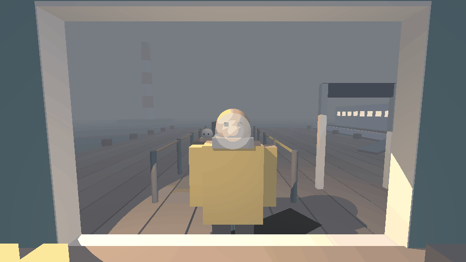
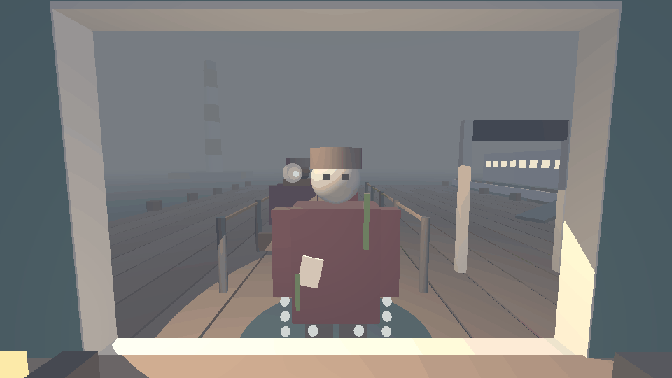
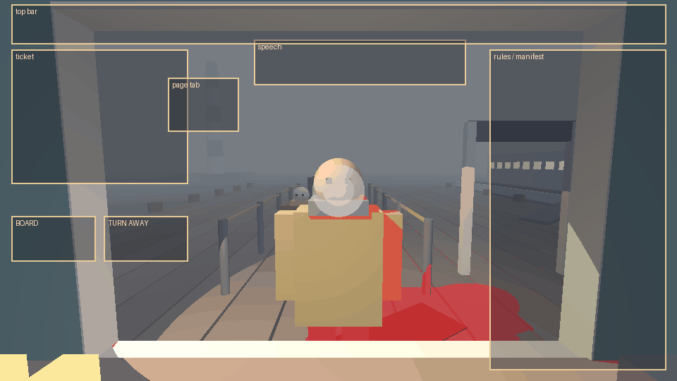

# Last Ferry

A Roblox rules-horror game from Phoenix Feather Studios. You work the night
ticket window for the last ferry to Gull Island. Twenty-seven years ago the
*Marigold* sank with everyone aboard, and this week the drowned are back in the
queue, trying to get home.

- **Five nights.** Each one adds a rule, and the drowned learn to hide one more
  tell.
- **Every passenger is a call:**
  1. Read the ticket.
  2. Look at the person: breath in the cold, dripping seawater, a shadow under
     the lamp, whether they know your name.
  3. Check the rules card and the manifest.
  4. Press **BOARD** or **TURN AWAY**.
- **Three lanterns a night.** Each wrong call puts one out. Lose all three and
  the tide comes in.
- **Four endings, one of them secret.** Plus a little girl in a red coat who
  asks every night whether this is the ferry home.
- **One to four players** share the booth, and anyone can make the call.
- **Controls:**
  - Drag, arrow keys or the right stick to look around; scroll, pinch or R2 to
    lean in.
  - **B** / **T** (gamepad **A** / **B**) to board or turn away, **P** (**X**)
    to take a torn page, and **Enter** to continue.

Everything is built from parts and code: no asset IDs, no licences to check.
The story design is in [GAME_DESIGN.md](GAME_DESIGN.md) and the code map is in
[ARCHITECTURE.md](ARCHITECTURE.md).

## What the booth sees

These are blockout renders of the real game's geometry: the server's world code
running in the test simulator, ray-traced by
[tools/preview](tools/preview/render.py). They're for layout, not looks. Roblox
will render the fog, light, materials and particles very differently.

| A living regular at the window | One of the drowned (1999 ticket) |
| --- | --- |
|  |  |

What they show:
- **Left:** the regular's breath fogs in front of their face, and their shadow
  falls on the planks behind and to their right. The lighthouse is far off to
  the left, and the *Petrel*'s lit cabin is on the right.
- **Right:** a drowned passenger is pale, with a darkened coat, seaweed, and no
  breath. Water drips from their cuffs and coat, and a puddle spreads around
  them. There is a torn ledger page tucked in their coat.



The booth lamp hangs front-left, so a passenger's shadow (tinted red here) falls
back and to the right across the planks, in view. The HUD leaves the bottom
centre clear for it.

## Status

| Area | State |
| --- | --- |
| Game logic (rules, queue generation, runs, endings) | Built, fuzz-tested over thousands of generated nights |
| Shift flow (intro, window, summary, retry, ending, co-op Continue) | Built, simulated end to end |
| Server (world, passengers, remotes, saves) and client (camera, HUD, effects) | Built, run together in a headless Roblox simulator |
| Looks, lighting, feel, pacing | **Not yet seen.** It needs a playtest in Roblox Studio on your machine ([PLAYTEST.md](PLAYTEST.md)) |
| Store page, badges, icon, questionnaire | To do before publishing (checklist below) |

## Play it in Studio

1. Get `LastFerry.rbxl`:
   - use the copy delivered with this build, or
   - build it with `rojo build -o LastFerry.rbxl`.
2. Open it in Roblox Studio and press **Play**. Everything (the harbor, the
   booth, the ferry, the fog) is built by the server script when it starts, so
   the place looks empty in Edit mode. That's expected.
3. Work through [PLAYTEST.md](PLAYTEST.md) and note anything that looks or feels
   wrong.

To work on the code with live sync, run `rojo serve` in this folder and connect
the Rojo plugin, or use Studio's Script Sync on `ServerScriptService` and
`ReplicatedStorage`. [AGENTS.md](AGENTS.md) explains the rules for doing that
with Claude Code or Codex.

## Checks

Run from this folder. The tools are pinned in `rokit.toml`, plus Lune for the
tests.

```sh
stylua --check ServerScriptService ReplicatedStorage tests
selene .
rojo sourcemap default.project.json -o sourcemap.json
luau-lsp analyze --platform roblox --sourcemap sourcemap.json \
  --definitions @roblox=<path to globalTypes.None.d.luau> ReplicatedStorage ServerScriptService
lune run tests/run.luau
rojo build -o LastFerry.rbxl
```

At the time of this build every check comes back clean:
- 51 tests pass.
- There are 0 selene findings.
- There are 0 strict type errors.

An independent review then checked what the tests can't: geometry against
Roblox's real conventions, replication, rendering and layering, and
readability. Its fixes are in:
- **Wet passengers:** drips and the puddle moved to where the booth can see
  them.
- **Lighting:** pinned for reliable shadows, with a fallback shadow mark for
  low-quality devices.
- **Radio and warnings:** Pike's radio pauses the queue, and lantern warnings
  moved to a top banner, so neither covers a passenger's face.
- **Plus:** taller cards, a delayed ending reveal, keyboard and gamepad
  shortcuts, and a gate the passengers fit through.

The tests have three layers:

1. **Logic** (`Rng`, `Rules`, `Generator`, `Run`):
   - Every generated night is fair: the living never show a supernatural tell,
     and every drowned passenger breaks a rule you can see.
   - Perfect play never loses a lantern.
   - Each ending is reachable.
2. **Shift flow** (`Director.spec`): whole runs on a simulated clock, including
   timeouts, retries, co-op Continue and ignored junk input. A bot that sees only
   the screen state plays perfectly, and nothing on screen reveals who is
   drowned.
3. **The real game, headless** (`Game.spec`):
   - The actual server and client scripts run together in `tests/sim`, a mock
     Roblox checked against the engine's API dump, on a virtual clock.
   - A bot reads the HUD and the passengers' visible tells, then presses the
     real buttons.
   - It finishes clean runs, the Mara ending, the ledger epilogue, and a
     late-joining co-op session.
   - It checks button sizes on phone-sized screens.

Mutation checks confirmed each layer fails when a real bug is planted (for
example, swapped buttons, a wrong date on the ticket, a missing manifest, or
breath never shown).

## Before publishing

- [ ] Playtest in Studio ([PLAYTEST.md](PLAYTEST.md)), including the phone
      device emulators and a 2-player local server.
- [ ] Game Settings → Places → Max Players: **4**.
- [ ] Game Settings → Security → turn on **Enable Studio Access to API
      Services** to test saving in Studio. The game runs without it and says so
      in the output.
- [ ] Create four badges on the Creator Dashboard:
      - The Petrel Sails
      - Mara Goes Home
      - Low in the Water
      - The Ledger (secret)

      Put their IDs in `BADGES` in
      `ServerScriptService/Services/ProgressService.luau`.
- [ ] Maturity & Compliance questionnaire: the target is **Mild fear** (see
      [GAME_DESIGN.md](GAME_DESIGN.md)): no blood, gore, or on-screen death.
- [ ] Icon, thumbnails, a 30-second trailer of the first two passengers, and a
      description that leads with the hook.
- [ ] Genre: Horror. Set the start place's server fill to "maximum" so friends
      land together.

Market context, the discovery rules for new games, and the kill and continue
thresholds are in `research/` at the repository root.
